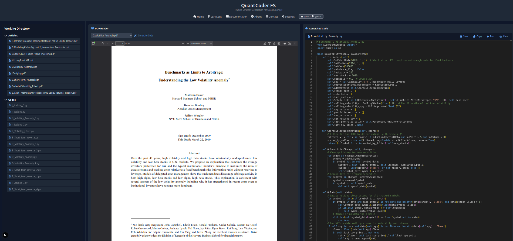
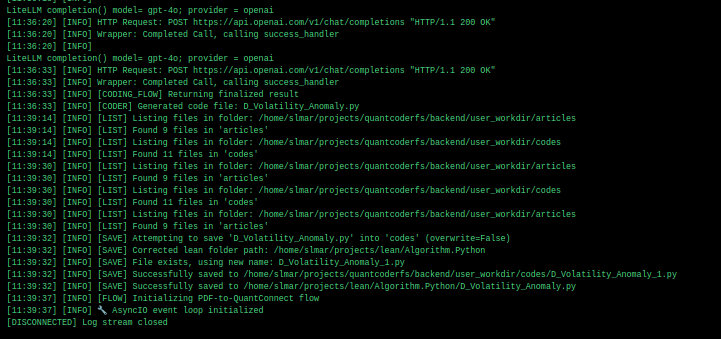
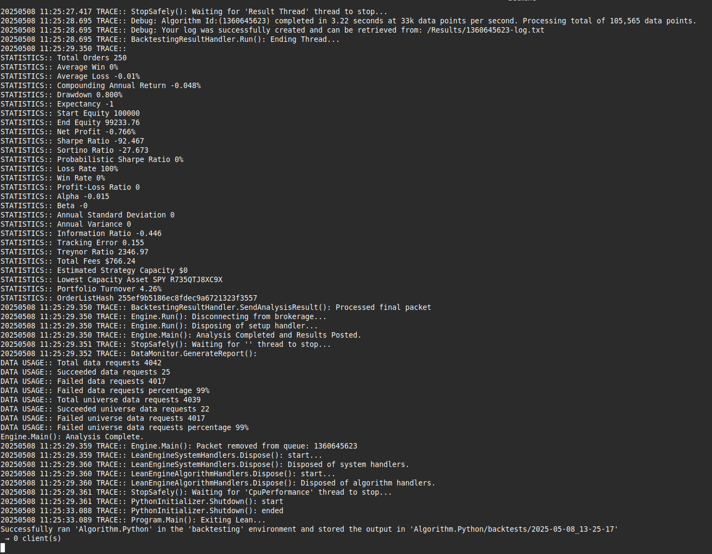

[](https://opensource.org/licenses/Apache-2.0)

# QuantCoder FS

**Local-first agent-based workflows for quantitative strategy extraction and automation**

**Development Status:** Active development on `dev` branch. Current focus is on optimizing the AI workflow to reduce latency and improve compilation success rates. Note: models such as `gpt-4o-mini` have exhibited compatibility issues with Pydantic-based output validation.

QuantCoder FS is a research platform that transforms financial articles into executable trading strategies using modular agentic pipelines. Designed to operate locally without reliance on cloud infrastructure or authentication systems, the platform enables structured exploration of language model capabilities in quantitative finance.

This repository contains the FastAPI backend, CrewAI-based agents, and modular orchestration logic for summarizing financial text and generating QuantConnect-compatible code. Performance depends on the selected LLM model and the clarity or relevance of the input article.

> The strategy research, including demonstrations and benchmarks, is published at: [https://quantcoderfs.substack.com/s/strategies](https://quantcoderfs.substack.com/s/strategies)
> Technical documentation and development updates are available at: [https://quantcoderfs.substack.com/s/development-updates-and-technical](https://quantcoderfs.substack.com/s/development-updates-and-technical)

---

## Project Scope

QuantCoder FS is not a software-as-a-service product. It is a reproducible environment for the automated transformation of financial content into Python code, backed by a formal and inspectable flow of operations:

* Parsing PDF or textual articles with embedded financial logic
* Extracting structural sections and generating condensed summaries
* Translating insights into boilerplate or production-ready trading code
* Running local backtests via LEAN CLI when appropriate

---

## Key Features

* Automated Research-to-Code workflow
* Structured CrewAI pipeline: PDF → Summary → Code → AST Validation → Refinement
* Local-first design: no login, no key storage
* Output persistence in both user workspace and Lean environment folders
* One-click local backtesting via LEAN engine

---

## Architecture Overview

```
Financial Article (PDF)
        ↓
 PDFLoader + TextPreprocessor
        ↓
 HeadingDetector + SectionSplitter
        ↓
     CrewAI Flow (CodingFlow)
        ↓
Extract → Summarize → Code → Validate → Refine
        ↓
   Save to disk + Trigger lean backtest (optional)
```

---

## CodingFlow v1.1 – Agent Workflow Description

The main orchestration is implemented as `CodingFlow` (defined in `flows/code.py`) and consists of a sequential CrewAI pipeline using five agents:

1. **Section Extraction**: PDF content is processed via OCR and rule-based logic to identify document structure.
2. **Summarization**: A dedicated agent condenses extracted sections into a concise, actionable summary.
3. **Code Generation**: A third agent synthesizes Python code targeting the QuantConnect API.
4. **AST Validation**: The generated code is parsed to check for syntax errors using Python’s `ast` module.
5. **Refinement**: If a syntax issue is detected, the code is automatically revised by a corrective agent.

Each stage is validated via typed Pydantic models (`SummaryResponse`, `GeneratedCode`) to ensure structural conformity.

---

### Interface Walkthrough

Below is a snapshot of the QuantCoder FS interface during the extraction and code generation process.


*Figure 1 – Interface showing the PDF reader (left) and generated QuantConnect code (right). The active document is “Benchmarks as Limits to Arbitrage: Understanding the Low Volatility Anomaly”.*

---

### LLM Workflow Trace

A detailed log from the backend console illustrates the successful completion of each agentic step.


*Figure 2 – Backend console log showing task dispatch and successful strategy generation using GPT-4.1.*

---

### Lean Backtest Output

Once code generation is complete, a local Lean backtest is triggered. The following screenshot shows the backtest results for the low volatility strategy.


*Figure 3 – LEAN backtest results printed in the terminal. The engine serves as both a compilation validator and a runtime executor.*

---

## PDF Analysis Pipeline

The section extraction logic used in the first stage of the flow is encapsulated in a custom CrewAI tool and consists of:

* `PDFLoader`: Reads the entire PDF content using `pdfplumber`, preserving page order.
* `TextPreprocessor`: Removes URLs, numbering, headers, and irrelevant formatting artifacts.
* `HeadingDetector`: Uses both rule-based regular expressions and spaCy NLP to detect potential section titles.
* `SectionSplitter`: Splits the text into structured sections based on detected headings, assigning each a `type_hint` field (e.g., "methodology", "findings").

---

## Backend Directory Structure

```bash
backend/
├── agents/        # CrewAI agents for parsing, summarizing, and coding
├── core/          # Logging configuration, environment settings, usage tracking
├── models/        # Typed Pydantic schemas
├── routers/       # FastAPI route definitions (e.g., /filemanager, /coder)
├── utils/         # Preprocessing and validation utilities
└── workflows/     # CrewAI flows, including CodingFlow
```

## Frontend Directory Structure

```bash
frontend/
├── components/    # PDF viewer, code display, chat panel
├── lib/           # State management and API abstraction
├── pages/         # Next.js page routing
├── public/        # Static assets (screenshots, icons)
├── styles/        # Global Tailwind CSS styles
├── types/         # TypeScript interfaces and shared types
├── next.config.js # Next.js config file
└── package.json   # Project metadata and dependencies
```

---

## Installation

### Step 1: Clone the repository

```bash
git clone https://github.com/SL-Mar/quantcoderfs.git
cd quantcoderfs
git checkout dev
```

### Step 2: Set up a virtual environment

```bash
python -m venv venv
source venv/bin/activate
pip install -r requirements.txt
```

### Step 3: Configure environment variables

```env
OPENAI_API_KEY=your-key-here
MODEL_NAME=gpt-4o
```

### Step 4: Launch the API server

```bash
uvicorn backend.main:app --reload --port 8000
```

Interactive documentation available at:
[http://localhost:8000/docs](http://localhost:8000/docs)

---

## End-to-End Workflow

1. Upload a PDF containing a trading-related research article.
2. The system parses and analyzes the document’s structure.
3. An LLM generates a summary and synthesizes initial code.
4. The code is checked for syntax errors and optionally refined.
5. A backtest may be triggered using Lean CLI.
6. The code is saved to both the working directory and Lean-compatible folders.
7. Results appear in the developer console or terminal.

---

## Lean Integration

When a strategy is successfully generated, a background process runs:

```bash
lean backtest "Algorithm.Python/<filename>.py"
```

This enables rapid iteration and testing using the local LEAN environment.

---

## Tooling Overview

| Component                 | Access | Description                                  |
| ------------------------- | ------ | -------------------------------------------- |
| QuantCoder FS Backend     | Open   | Modular PDF → Code pipeline                  |
| Frontend Interface        | Open   | Stateless Next.js app                        |
| Authentication / Accounts | None   | No user accounts or login required           |

---

## License

This software is released under the Apache License 2.0.
See `LICENSE.md` for terms of use and redistribution.

---

## References

* [QuantCoder FS Documentation & Updates](https://quantcoderfs.substack.com/s/development-updates-and-technical)
* [QuantCoder FS: Strategy Research](https://quantcoderfs.substack.com/s/strategies)
* [Medium: *Toward Automating Quantitative Finance Research*](https://medium.com/ai-advances/towards-automating-quantitative-finance-research-c868a2a6477e)

---

## Citation

```
S.M. Laignel. (2025). QuantCoder FS: LLM-powered strategy coding and automation for Quantitative Finance. GitHub Repository. https://github.com/SL-Mar/quantcoderfs
```

---

## Contributing

Development occurs on the `dev` branch. Please submit pull requests against `dev`. I welcome contributions to:

* New agent types or flows
* Frontend interface improvements
* PDF parsing tools or validation enhancements

---

## Known Issues

* `gpt-4o-mini` occasionally returns non-conforming outputs that fail Pydantic validation and for this reason, is normally de-activated in the selection list.
* `o1` is excessively expensive and should be avoided. It is by default de-activated in the code.
* OCR-based PDFs are currently not supported. The system assumes machine-readable text.
* Latency and error rate are higher when summarization is run on documents with inconsistent or sparse structure.

---

## Changelog

**Current Version:** v1.1 (AI Workflow)

* Introduced `CodingFlow v1.1` using CrewAI sequential tasking.
* Added syntax validation and conditional refinement.
* Enabled local backtesting via Lean CLI integration.

This version defines the current software baseline. Future versions will align with major changes to agent logic or orchestration.

---

## Author

<p align="center">
  <b>S.M. Laignel</b><br>
  Founder of <b>SL MAR</b> consultancy<br>
  Quant Developer — modular automation for research workflows in quantitative finance.<br><br>
  🌐 <a href="https://quantcoderfs.substack.com">Substack — QuantCoderFS R&D</a><br>
  💻 <a href="https://github.com/sl-mar/quantcoderfs">GitHub Repository</a>
</p>
